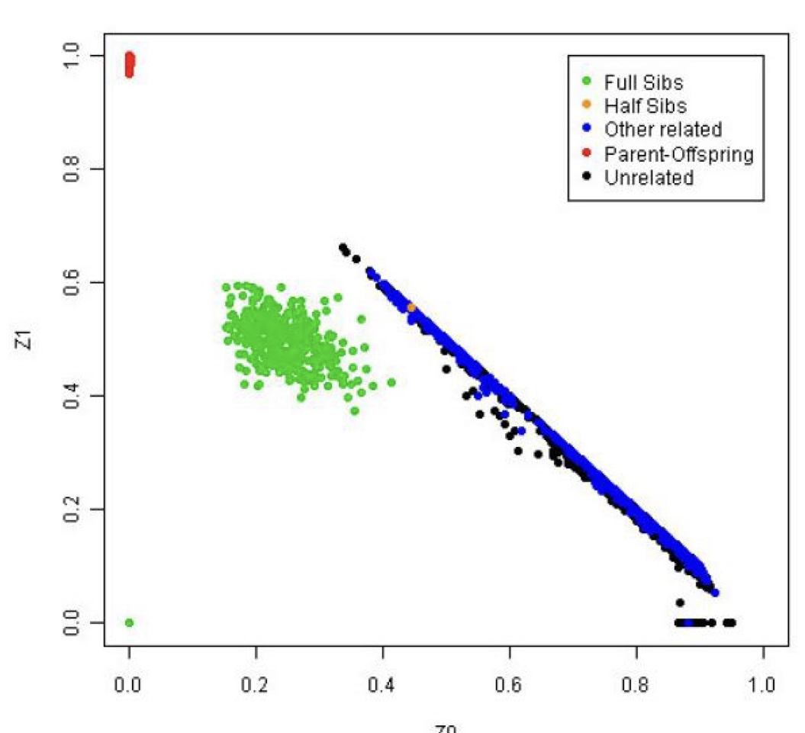

## Introduction
Relatedness filtering removes the duplicate records and individuals that are highly related. 

## Flag Index
* `--autosome`: excludes all unplaced and non-autosomal variants

* `--bed`: specify the name/path of .bed file

* `--bfile`: specify the name/path of bed/bim/fam files

* `--bim`: specify the name/path of .bim file

* `--extract`: filter out variants that are not in the file provided

* `--fam`: specify the name/path of .fam file

* `--geno`: filter out the variants with a threshold of 0.01 (filter SNPs with a call rate of <99%)

* `--genome`: create IBD report

* `--het`: compute the observed and expected autosomal homozygous genotype values for each sample and writes it in .het file

* `--make-bed`: generate bed/bim/fam file set

* `--out`: specify the name of the output files

## 1. Create a pruned list of SNP IDs
The set of data in hapmap3 has various populations within it. In order for there to be proper IBD analyses, the populations need to be separated. 

The population samples and their labels can be found in the [hapmap3 index](ftp://ftp.ncbi.nlm.nih.gov/hapmap/genotypes/hapmap3/plink_format/draft_2) under phase_3_samples.doc. 

For example, the ASW or African ancestry in Southwest USA populations can be separated out as so:

```{}
grep "ASW" relationships_w_pops_121708.txt
```

The following populations were grouped:

* African: ASW, LWK, MKK, YRI

* East Asian: CHB, JPT

* Utah: CEU

* Colorado Chinese: CHD

* Gujarati: GIH

* Mexican: MEX

* Toscans: TSI

New bed/bim/fam files need to be created with the separate populations. For example, the African population:

```{}
./plink --bfile hapmap3_01_5 --keep hapmap_African_populations.txt --make-bed --out hapmap_African
```
### Files created with African population subset:

* hapmap_African.hh

* hapmap_African.bed

* hapmap_African.bim

* hapmap_African.fam

* hapmap_African.log


```{}
./plink --bfile hapmap_African --autosome --indep-pairwise 50 5 0.2 --out hapmap3_02_1_African
```
### Files created in Step 1:
  
* hapmap3_02_1_African.log

* hapmap3_02_1_African.prune.in
  
* hammap3_02_1_African.prune.out

## 2. Determine the IBD of samples
```{}
./plink --bfile hapmap_African --extract hapmap3_02_1_African.prune.in --genome --out hapmap3_02_2_African
```
### Files created in Step 2:

* hapmap3_02_2_African.genome
  
* hapmap3_02_2_African.hh
  
* hapmap3_02_2_African.log
  
In order to check the IBD:
```{}
library("ggplot2")
ibd <- read.table("hapmap3_02_2_African.genome", header = T)
ggplot(data=ibd,aes(x=Z0,y=Z1))+geom_point(alpha=1/4)+theme_bw()
```

```{r, echo = FALSE}
library("ggplot2")
ibd <- read.table("hapmap3_02_2_African.genome", header = T)
ggplot(data=ibd,aes(x=Z0,y=Z1))+geom_point(alpha=1/4)+theme_bw()
```

Compare this plot to the one seen in "Quality Control Procedures for Genome Wide Association Studies" which can be found [here](https://www.ncbi.nlm.nih.gov/pmc/articles/PMC3066182/).



## 3. Check the heterozygosity in the samples
```{}
./plink --bed hapmap3_5.bed --bim hapmap3_5.bim --fam hapmap3_5.fam --het --out hapmap3_02_3
```
### Files created in Step 3:

* hapmap3_02_3.het
  
* hapmap3_02_3.hh
  
* hapmap3_02_3.log

## 4. LD prune SNPs from bfiles
```{}
./plink --bed hapmap3_5.bed --bim hapmap3_5.bim --fam hapmap3_5.fam --extract hapmap3.prune.in --make-bed --out hapmap3_02_4
```
### Files created in Step 4:

* hapmap3_02_4.bed
  
* hapmap3_02_4.bim
  
* hapmap3_02_4.fam
  
* hapmap3_02_4.hh
  
* hapmap3_02_4.log

## 5. Remove dumplicate or related samples & regenerate heterozygosity estimates from the filtered samples
```{}
./plink --bfile hapmap3_02_4 -het --out hapmap3_02_5
```
### Files created in Step 5:

* hapmap3_02_5.het
  
* hapmap3_02_5.hh
  
* hapmap3_02_5.log


